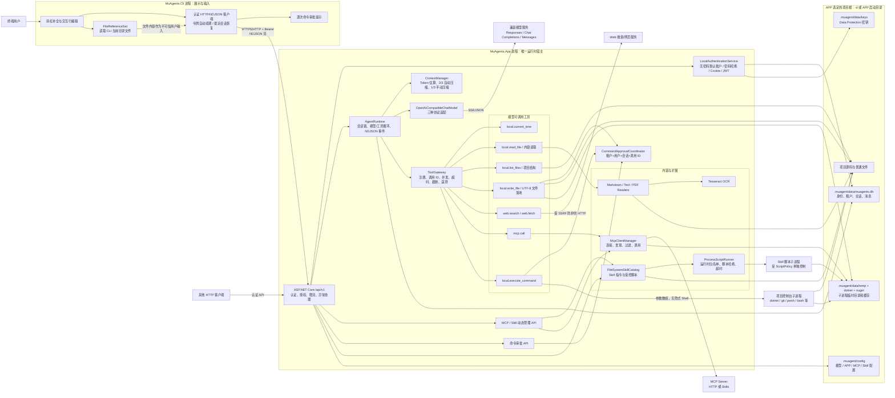
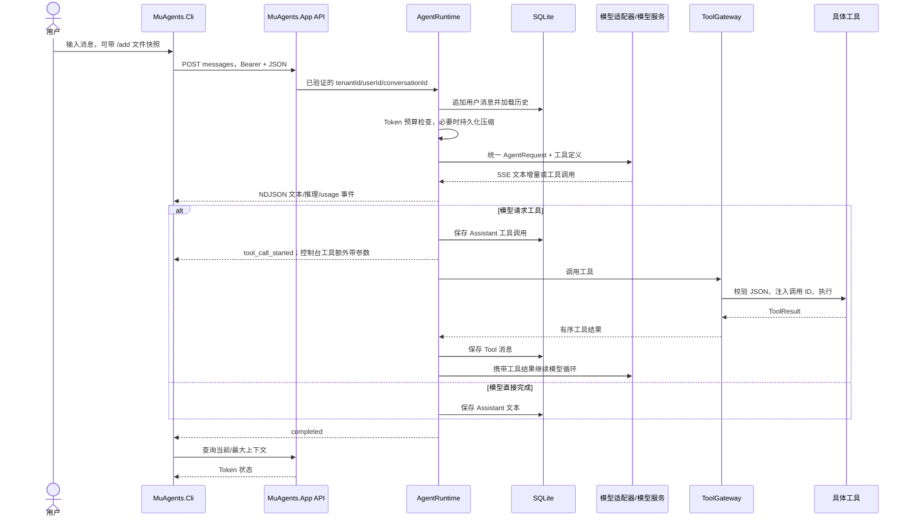
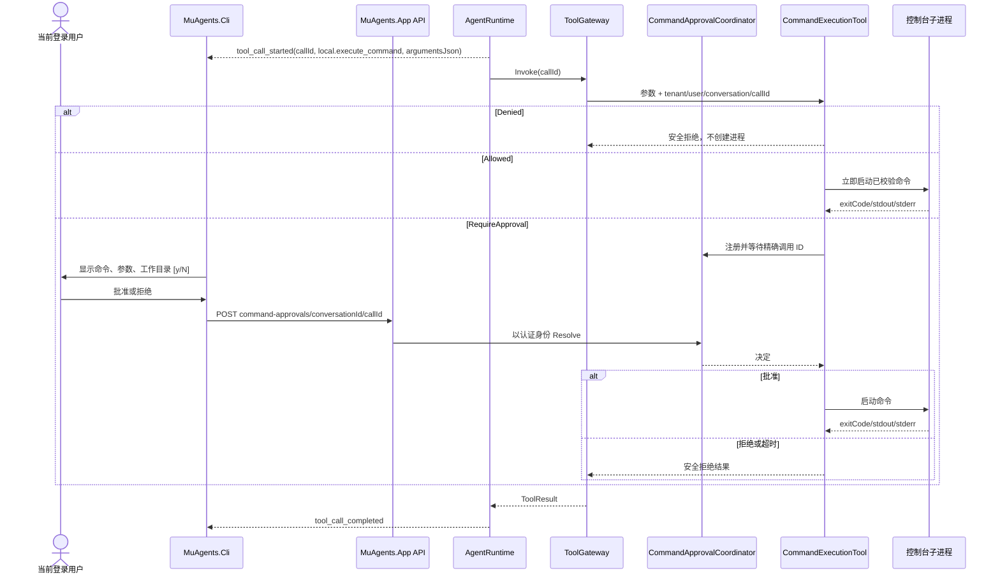

# MuAgents 设计文档（v0.3）

## 1. 项目定位

MuAgents 是一个使用 C#/.NET 构建的跨平台 Agent 应用程序。它负责组织模型对话、工具调用、MCP、Web 信息获取、多模态输入、文件读取、Skill 加载及超长上下文压缩，并通过适配器兼容主流模型接口。

产品以可直接运行的应用程序交付，内置 ASP.NET Core 服务和命令行入口；核心能力仍拆分为类库，方便测试和二次开发。运行时不绑定某一家模型供应商，目标平台为 Windows、Linux、macOS 和容器环境。

## 2. 设计目标

- 同时支持 Chat Completions、Responses 和 Messages 风格接口及流式输出。
- 支持文本和图片消息输入，让具备视觉能力的模型读取图片。
- 支持本地工具、MCP 工具与 Web 获取工具的发现、调用和结果回传。
- 支持读取 Markdown、文本型 PDF、扫描型 PDF（OCR）和 Skill，并把内容按预算注入上下文。
- 支持在受控执行环境中运行 Skill 自带脚本。
- 支持 SQLite 持久化、多用户身份认证和租户级数据隔离。
- Agent 根据用户意图和系统策略自主决定是否调用 Web 搜索及网页读取工具。
- 最大上下文大小可按模型或会话配置。
- 预计下一次请求超过最大上下文的 `2/3` 时，自动压缩历史，并以压缩结果作为新对话起点。
- 组件可替换、可测试，并具备超时、取消、审计和错误隔离能力。

## 3. 非目标（首版）

- 不训练或微调模型。
- 不实现浏览器 GUI 自动化；Web 首版由 Agent 自主调用搜索、HTTP 获取和正文抽取工具。
- 不把向量数据库作为必要依赖。
- 不保证所有“OpenAI 兼容”服务的私有扩展均可直接使用。
- 不承诺不受信任脚本的“绝对安全”；首版通过权限、工作目录、超时、资源限制和容器化选项降低风险。

## 4. 总体架构

下图描述当前代码的实际进程、模块和数据边界。CLI 是远程展示客户端，不承载 Agent、MCP 或控制台进程；这些能力全部位于 APP：



实际源码依赖保持单向：`MuAgents.App` 通过 `MuAgents.Hosting` 装配具体实现；`Core` 只依赖 `MuAgents.Abstractions` 中的模型、工具和存储契约，不直接依赖模型供应商 SDK。`MuAgents.Cli` 只依赖 HTTP 契约和本地文件引用逻辑，不引用 APP 的运行时服务。

### 4.1 一次对话和工具调用



### 4.2 控制台逐次审批链路



## 5. 核心领域模型

```csharp
public sealed record AgentMessage(
    string Id,
    AgentRole Role,
    IReadOnlyList<MessagePart> Parts,
    DateTimeOffset CreatedAt,
    MessageMetadata? Metadata = null);

public abstract record MessagePart;
public sealed record TextPart(string Text) : MessagePart;
public sealed record ImagePart(ImageSource Source, string? MediaType) : MessagePart;
public sealed record ToolCallPart(string CallId, string Name, string ArgumentsJson) : MessagePart;
public sealed record ToolResultPart(string CallId, string Content, bool IsError) : MessagePart;

public sealed record AgentRequest(
    IReadOnlyList<AgentMessage> Messages,
    IReadOnlyList<ToolDefinition> Tools,
    ModelParameters Parameters);
```

内部消息模型不直接复用任何供应商 DTO。Chat Completions、Responses 和 Messages 适配器分别负责协议转换，避免协议变化污染核心逻辑。“Messages 支持”包括消息角色、文本/图片内容块、工具调用/工具结果、系统指令和流式增量的双向映射。

## 6. Agent 执行循环

```text
接收输入
  -> 解析附件和显式 Skill
  -> 构建候选上下文
  -> 估算下一请求 token
  -> 必要时压缩
  -> 调用模型（支持流式事件）
  -> 若无工具调用：完成
  -> 校验并执行工具调用
  -> 将工具结果加入会话
  -> 再次进行预算检查并调用模型
  -> 达到终止条件或最大轮数
```

建议公开流式事件，而不是只返回字符串：

- `TextDelta`
- `ReasoningDelta`（供应商支持时，可配置是否暴露）
- `ToolCallStarted` / `ToolCallCompleted`
- `CompactionStarted` / `CompactionCompleted`
- `UsageUpdated`
- `Warning` / `Error` / `Completed`

每轮必须接受 `CancellationToken`。配置 `MaxToolIterations`（默认 24），防止模型无限调用工具。到达上限时必须先执行并持久化已经保存的工具调用结果，再结束本轮，禁止把没有对应 `ToolResultPart` 的悬空调用留给下一轮上下文。加载旧会话时自动移除不成对的工具部分但保留普通消息；模型返回空事件流时按 `MaxEmptyResponseRetries` 重试，不能将空白标记为成功回答。

## 7. 模型与协议兼容层

核心接口建议：

```csharp
public interface IChatModel
{
    IAsyncEnumerable<ModelEvent> CompleteAsync(
        AgentRequest request,
        CancellationToken cancellationToken);
}
```

OpenAI 兼容配置至少包含：

```json
{
  "Provider": "openai-compatible",
  "BaseUrl": "https://example.com/v1",
  "ApiKeyEnvironmentVariable": "MUAGENTS_API_KEY",
  "Model": "model-name",
  "MaxContextTokens": 128000,
  "MaxOutputTokens": 4096,
  "SupportsVision": true,
  "SupportsTools": true,
  "Tokenizer": "auto"
}
```

首版同时实现三类协议：

- Chat Completions：`/chat/completions`、SSE、`messages`、`tool_calls` 和多模态内容块。
- Responses：`/responses`、流式事件、`input`/`output` items、函数工具和图片输入。
- Messages：可配置 endpoint，支持 `messages`、独立 system 字段、content blocks、tool use/tool result 和事件流。

三个适配器统一转换为内部 `AgentMessage` 和 `ModelEvent`，保持 Agent 循环一致。工具参数碎片聚合完成后必须验证为 JSON 对象；若输出 Token 上限造成参数截断，则保存合法的恢复错误并反馈模型拆小重试，绝不能把残缺 JSON 带入下一轮协议历史。配置通过 `Protocol` 选择 `ChatCompletions`、`Responses` 或 `Messages`。密钥只允许来自环境变量、Secret Provider 或宿主注入，不写入普通配置和日志。

不同兼容服务对消息格式、工具调用、usage 和流式增量的实现经常不一致，因此增加 `ProviderCapabilities` 与协议兼容性测试，不仅依赖一个 `BaseUrl`。应用对外也提供版本化 HTTP API；它是 MuAgents 的应用接口，不假冒完整的模型供应商服务。

## 8. 上下文管理与自动压缩

### 8.1 预算定义

```text
request_budget = max_context_tokens - reserved_output_tokens - safety_margin
compact_threshold = floor(max_context_tokens * compact_ratio)
默认 compact_ratio = 0.6667
```

压缩判断应计算“系统提示词 + Skill + 历史消息 + 工具定义 + 附件内容 + 当前输入 + 预留输出”，不能只计算聊天历史。

触发条件：

```text
estimated_next_request_tokens >= min(request_budget, compact_threshold)
```

`MaxContextTokens`、`ReservedOutputTokens`、`CompactionRatio` 和 `SafetyMarginTokens` 均可配置。若供应商返回实际 usage，用其校正本地估算。

### 8.2 压缩结果

压缩不是简单删除旧消息，而是生成结构化检查点：

```markdown
# Conversation checkpoint
## User goal
## Confirmed requirements
## Decisions and rationale
## Completed work
## Current state
## Files/artifacts involved
## Tool results that remain relevant
## Open questions and next actions
```

新会话上下文由以下部分组成：

1. 原始且稳定的系统指令。
2. 压缩检查点（标注来源范围和时间）。
3. 不能丢失的最近消息、未完成工具调用及其结果。
4. 当前用户输入。

压缩前的原始消息保留在会话存储中，仅从模型工作上下文移出，以便审计和重新压缩。检查点保存 `SourceMessageIds`、压缩模型、token 使用量和版本。

### 8.3 压缩失败与极端输入

- 压缩模型失败时重试一次，再使用确定性裁剪并给出警告。
- 单个文件或工具结果过大时先分块摘要，不能依靠整段会话压缩解决。
- 当前用户消息本身超过预算时拒绝请求，并返回可操作的大小提示。
- 工具结果设置单次最大字符/token 数；超出后保存完整产物引用，只把摘要放进上下文。
- 保留最近若干轮原文，减少摘要逐轮漂移。

## 9. 工具系统

统一所有工具来源：

```csharp
public interface IAgentTool
{
    ToolDefinition Definition { get; }
    Task<ToolResult> InvokeAsync(
        JsonElement arguments,
        ToolExecutionContext context,
        CancellationToken cancellationToken);
}
```

`ToolGateway` 负责：

- 工具注册、命名冲突处理和 JSON Schema 校验。
- 并行执行彼此独立的工具调用。
- 超时、取消、并发上限和结果大小限制。
- 把供应商工具调用 ID 注入 `ToolExecutionContext`，供审批能力绑定到精确调用。
- 异常转换为模型可理解但不泄露堆栈/密钥的结果。
- 调用 ID、耗时、状态和结果摘要审计。

当前模型工具包括 `local.current_time`、`local.list_files`、`local.read_file`、`local.write_file`、`local.execute_command`、`web.search`、`web.fetch` 和统一 MCP 入口 `mcp.call`。运行时始终加入可信编码代理指令：开发任务必须先检查项目、实际写入文件并在权限允许时执行验证，不能只在聊天中粘贴代码后声称完成。文件写入与控制台执行共用三档策略：`Denied` 在修改前拒绝；`RequireApproval` 通过 `CommandApprovalCoordinator` 等待当前认证用户批准；`Allowed` 通过校验后自动执行。文件工具拒绝 `.muagent`、项目外路径及符号链接逃逸；命令和参数始终分开传递，工作目录必须在 APP 项目根内。二者临时数据分别使用 `.muagent/data/temp/workspace-writes` 和 `.muagent/data/temp/commands`。

## 10. MCP 集成

`McpClientManager` 管理多个 Server Profile，支持 stdio 与 Streamable HTTP；若目标生态有需要，再兼容旧版 SSE transport。

每个 MCP Server 可配置：

- `Enabled`
- transport、command/url 和环境变量引用
- 连接及调用超时
- 允许/拒绝的工具清单
- 工具名前缀
- 是否允许自动重连
- 信任级别和审批策略

启动时不应因某个 MCP 不可用而使整个 Agent 失败。工具列表可懒加载并带 TTL 缓存；调用前再次检查连接状态。MCP 返回的 resources/prompts 首版可以只通过显式 API 使用，避免未经选择全部注入上下文。

## 11. Web 信息获取

拆分为两个能力：

- `IWebSearchProvider`：查询搜索服务并返回标题、URL、摘要和时间。
- `IWebContentFetcher`：HTTP 下载、内容类型检测、正文抽取和长度限制。

安全要求：限制协议为 HTTP/HTTPS，阻断回环、私网和云元数据地址，限制重定向、响应大小、下载时间及 MIME 类型，防止 SSRF。结果必须保留 URL、抓取时间和标题，模型回答时可生成来源引用。

搜索供应商凭据通过宿主注入。若没有配置搜索服务，仍可允许用户显式 URL 抓取。

Web 工具常驻工具目录，由 Agent 根据用户指令、信息时效性、已有上下文和系统策略自行决定是否调用，不要求用户使用特殊命令。系统提示明确规定：涉及最新信息、外部事实核验或用户明确要求查找时优先搜索；已有可靠上下文足够时避免无意义联网。搜索工具至少需要一个可替换 provider，实现可以是搜索 API、MCP 搜索服务或自建搜索代理；不能只靠普通网页抓取模拟搜索。

## 12. 图片输入

支持三种 `ImageSource`：

- HTTPS URL
- 本地文件/上传文件引用
- Base64/Data URL（设置严格大小上限）

进入模型前执行：MIME 嗅探、扩展名交叉检查、文件大小和像素限制、EXIF 清理（可选）、必要时缩放/转码。若模型不支持视觉输入，应在调用前返回明确错误，不能把二进制误当文本。

图片 token 估算因供应商而异，`ITokenEstimator` 需要接受模型能力参数并保留安全余量。

## 13. 文件读取

### Markdown

- UTF-8 优先并处理 BOM。
- 保留标题层级、代码块和链接。
- 支持按标题或 token 大小分块。
- YAML front matter 解析为元数据，不默认作为高优先级指令执行。

### PDF

- 提取页级文本并保留页码，方便引用。
- 处理加密、损坏、无文本层和超大文件等错误。
- 首版必须支持扫描 PDF OCR。先检测页面文本覆盖率，仅对无文本层或低质量页面渲染图片并执行 OCR，避免重复识别。
- OCR 通过 `IOcrEngine` 抽象，默认实现必须可在 Windows、Linux、macOS 运行，支持至少中英文语言包；语言、DPI、页数和并行度可配置。
- OCR 结果保留页码、置信度和文字边界；低置信度内容显式标记，不能伪装成可靠原文。
- 表格和多栏排版可能导致阅读顺序错误，需要在结果元数据中标明提取质量。

统一接口：

```csharp
public interface IContentReader
{
    bool CanRead(ContentDescriptor content);
    Task<ContentDocument> ReadAsync(
        ContentDescriptor content,
        ReadOptions options,
        CancellationToken cancellationToken);
}
```

所有附件先解析为带来源信息的 `ContentDocument`，再由上下文管理器按预算选择原文、分块或摘要。

## 14. Skill 系统

一个 Skill 建议采用目录结构：

```text
skills/<skill-name>/
  SKILL.md
  references/
  scripts/
  assets/
```

`SKILL.md` 使用 YAML front matter 描述 `name`、`description`、`version`、适用条件、所需工具、权限和入口文件，正文保存工作说明。

加载流程：

1. 从配置目录发现 Skill，并校验名称、路径和元数据。
2. 根据用户显式指定或描述匹配选择 Skill。
3. 先注入最小必要说明，再按 Skill 路由读取引用文件。
4. 检查依赖工具和权限；缺失时返回可解释错误。
5. 将 Skill 名称和版本记录到会话检查点。

Skill 内容视为非可信输入：禁止路径穿越；Skill 请求的工具权限不能越过宿主策略。脚本允许执行，但必须通过 `IScriptRunner`，不能由 Agent 直接拼接 shell 命令。执行器按清单声明的运行时（例如 PowerShell、Bash、Python、Node 或 .NET）启动独立进程，使用固定参数数组、Skill 专属临时工作目录、最小环境变量、超时、输出上限和取消令牌。

脚本执行策略分为 `Denied`、`RequireApproval`、`Allowed` 三档，默认 `RequireApproval`。应用允许配置解释器白名单、网络权限、可读写目录和资源限制；部署到容器时优先使用独立受限容器执行高风险脚本。脚本及其依赖需要哈希审计，运行结果和退出码写入工具调用记录。

## 15. 会话与持久化

抽象接口 `IConversationStore`，首版以 SQLite 作为正式持久化实现，内存实现只用于测试和临时会话：

- 会话元数据及模型配置快照
- 原始消息和内容块
- 工具调用与结果引用
- 压缩检查点及来源消息范围
- token 使用量和错误事件

同一会话使用异步锁或乐观并发版本，避免两个请求同时修改历史。附件和大型工具产物通过 `IArtifactStore` 存储，消息只保存内容哈希和引用。

应用内置用户和租户模型。每条会话、消息、附件、检查点、凭据引用和审计记录必须带 `TenantId`，用户通过成员关系访问租户资源。SQLite 查询必须由租户感知的数据访问层自动附加隔离条件，不能依赖业务调用方手工过滤。空身份库允许 CLI 自动建立无密码的本地 `admin`；显式 `--setup-password` 初始化或 APP 本机 `--set-password <用户>` 后使用平台标准密码哈希，CLI 只有在空密码登录被拒绝后才交互读取密码。无密码模式仅面向回环地址开发环境。API Key/模型密钥使用项目秘密配置或外部 Secret Provider。数据库迁移、备份、恢复和数据保留策略属于正式交付范围。

## 16. 配置草案

```json
{
  "MuAgents": {
    "Agent": {
      "MaxToolIterations": 24,
      "MaxEmptyResponseRetries": 2,
      "ToolTimeoutSeconds": 60
    },
    "Model": {
      "Protocol": "Responses",
      "BaseUrl": "https://example.com/v1",
      "Model": "model-name"
    },
    "Context": {
      "MaxContextTokens": 128000,
      "ReservedOutputTokens": 4096,
      "CompactionRatio": 0.6667,
      "SafetyMarginTokens": 1024,
      "RecentTurnsToKeep": 4
    },
    "CommandExecution": {
      "ApprovalMode": "RequireApproval",
      "AllowedCommands": [ "dotnet", "git", "pwsh.exe" ],
      "ApprovalTimeoutSeconds": 120,
      "MaxExecutionSeconds": 120,
      "MaxOutputCharacters": 48000
    },
    "Content": {
      "MaxFileBytes": 26214400,
      "MaxImageBytes": 10485760,
      "MaxToolResultTokens": 12000,
      "OcrEnabled": true,
      "OcrLanguages": [ "chi_sim", "eng" ],
      "OcrDpi": 300
    },
    "Persistence": {
      "Provider": "Sqlite",
      "ConnectionString": "Data Source=data/muagents.db"
    },
    "Web": {
      "AgentMaySearch": true,
      "SearchProvider": "configured-provider"
    },
    "Skills": {
      "ScriptPolicy": "RequireApproval",
      "AllowedRuntimes": [ "dotnet", "python", "node", "pwsh", "bash" ]
    },
    "Security": {
      "AllowPrivateNetworkFetch": false,
      "RequireApprovalForMutatingTools": true
    }
  }
}
```

APP 启动时先解析 `-d <项目路径>`/`--directory <项目路径>` 参数；未提供时以 APP 启动终端当前目录作为项目根。项目运行状态统一保存到 `<项目>/.muagent/`。上述相对数据库路径实际解析为 `.muagent/data/muagents.db`；MCP、Skill 和模型配置分别位于 `.muagent/config/`，因此多个项目不会共享会话、身份或扩展状态。API 启动日志和认证后的 `/api/v1/runtime` 会报告实际项目根、状态根、控制台审批模式及参与合并的配置文件。CLI 不解析 `-d`，也不创建状态目录；CLI 当前目录只用于本地文件引用。

配置优先级为：代码默认值 < 安装目录 `appsettings.json`/模板 < 项目 `.muagent/config/appsettings.json` < 项目 `.muagent/config/muagents.settings.json` < 环境变量 < 启动参数 < 会话级覆盖。对每项配置启动时进行范围校验。

## 17. 安全边界

- 明确区分系统指令、用户输入、Skill 内容、网页/PDF 内容和工具结果的信任级别。
- 外部内容中的“指令”默认只作为数据，降低提示注入风险。
- 文件系统工具限制到配置的工作区根目录，规范化路径后再鉴权。
- 每次数据访问都校验用户、租户和资源归属，避免跨租户读取会话或附件。
- MCP、Web 和本地工具均执行 allowlist/denylist 策略。
- 日志自动脱敏 API Key、Authorization、Cookie 和可能的个人数据。
- 有副作用的工具由宿主策略决定是否需要用户确认。
- 控制台审批按租户、用户、会话和工具调用 ID 四层绑定；默认拒绝、过期决定不可复用。
- 控制台子进程关闭标准输入、限制项目内工作目录、执行时间和输出，且把所有常见临时/运行时缓存重定向到项目 `.muagent/data`。
- 限制工具循环、递归 Skill、并发量、下载大小和总执行时间。
- Skill 脚本以独立进程或受限容器运行；记录命令、参数、脚本哈希、授权人和退出状态。

## 18. 可观测性与错误模型

使用 `Microsoft.Extensions.Logging` 和 `System.Diagnostics.Activity`。建议指标：

- 模型请求耗时、首 token 延迟、输入/输出 token
- 压缩次数、压缩前后 token、压缩失败次数
- 工具调用次数、耗时、超时及错误率
- MCP 连接状态和重连次数
- Web/PDF/Skill 读取大小和解析失败率

统一错误分类：`Configuration`、`Authentication`、`RateLimit`、`Timeout`、`Cancelled`、`InvalidModelResponse`、`ToolFailure`、`ContentFailure`、`SecurityDenied`。只有幂等操作可以自动重试，并对 429/5xx 使用指数退避与抖动。

## 19. 测试策略

- 单元测试：预算计算、压缩触发边界、消息转换、工具 Schema、路径安全和 URL 安全。
- 黄金测试：固定对话压缩后必须保留目标、约束、文件状态和未完成事项。
- 合同测试：分别对 Chat Completions、Responses、Messages 的请求、流式响应和工具调用碎片合并进行录制样例测试。
- 集成测试：假模型服务、假 MCP Server、临时 HTTP Server、MD/PDF/扫描 PDF/图片样本、OCR 和 Skill 脚本执行器。
- 隔离测试：验证不同租户无法通过 ID 猜测、搜索、附件引用或导出接口读取彼此数据。
- 平台矩阵：Windows、Linux、macOS；发布和容器测试至少覆盖 x64，视需求增加 arm64。
- 故障测试：超时、取消、断流、429、畸形 JSON、MCP 掉线、超大工具结果。
- 端到端测试：用户输入 -> 多轮工具 -> 压缩 -> 新上下文 -> 最终回答。

## 20. 建议实施阶段

### M1：最小 Agent 内核

建立可执行 ASP.NET Core 应用、领域模型、Chat Completions/Responses/Messages 三类适配器、流式对话、工具循环、SQLite 会话和基础测试。

### M2：上下文与内容

实现 token 估算、`2/3` 自动压缩、MD/PDF、扫描 PDF OCR、图片输入、附件预算和检查点测试。

### M3：外部能力

实现 MCP、Agent 自主 Web 搜索/抓取、Skill 加载与脚本执行、安全策略和工具审计。

### M4：生产化

完善多用户/多租户隔离、身份认证、指标追踪、重试/限流、备份恢复、协议兼容性测试矩阵及 Windows/Linux/macOS/容器发布。

## 21. 已确认的产品决策与待定项

已确认：

1. 交付独立应用程序，内部核心模块保持类库化。
2. 首版同时支持 Chat Completions、Responses 和 Messages 风格接口。
3. 首版支持扫描 PDF OCR。
4. Agent 根据自然语言指令和策略自主使用 Web 搜索，无需特殊命令。
5. Skill 允许执行自带脚本，但必须受权限和执行沙箱约束。
6. 首版使用 SQLite 持久化，并支持多用户和租户隔离。
7. 基于现代 .NET 跨平台发布，兼容 Windows、Linux、macOS 和容器。
8. 只有 APP 选择项目根并保存 `.muagent` 状态；CLI 是 HTTP/NDJSON 客户端，不接受 `-d`。
9. Agent 可调用项目控制台，默认采用逐次用户审批，并提供完全禁止和自动允许模式。

仍需在实现前或实现过程中确定：

1. 应用首版是否需要图形界面；当前设计默认提供 HTTP API 与 CLI。
2. Messages 需要精确兼容的供应商和版本，以建立协议测试样例。
3. Web 搜索的默认 provider；架构允许 API、MCP 或自建服务替换。
4. OCR 默认引擎及中英文模型的分发方式和许可证审查。
5. 多租户是共享 SQLite 数据库逻辑隔离，还是每租户独立数据库；当前默认共享库逻辑隔离。
6. 是否要求 Native AOT；带 OCR、动态 Skill 和部分数据库依赖时需要单独评估。

## 22. 本版额外补充的关键能力

在原始需求之外，建议把以下内容视为核心需求，而不是后期补丁：

- token 预算必须包含工具定义、图片、附件和预留输出。
- 压缩要可审计、可恢复，并保留最近原文，避免摘要漂移。
- 工具统一抽象，同时具备超时、取消、结果限长和最大循环次数。
- Web 必须有 SSRF 防护，文件与 Skill 必须有路径沙箱。
- 模型能力显式声明，提前拒绝不支持视觉或工具的请求。
- 流式事件模型、结构化错误和可观测性从首版确定，否则后续 API 很难兼容演进。
